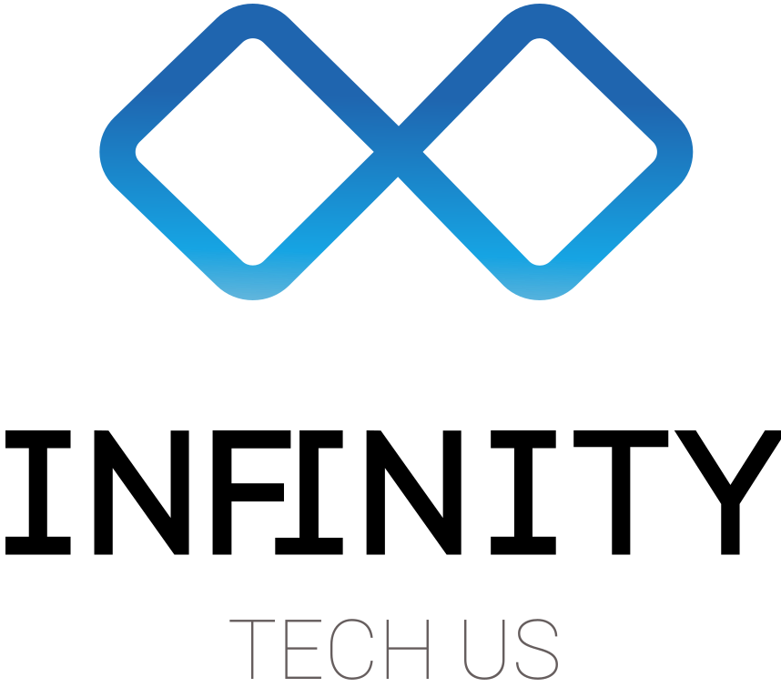
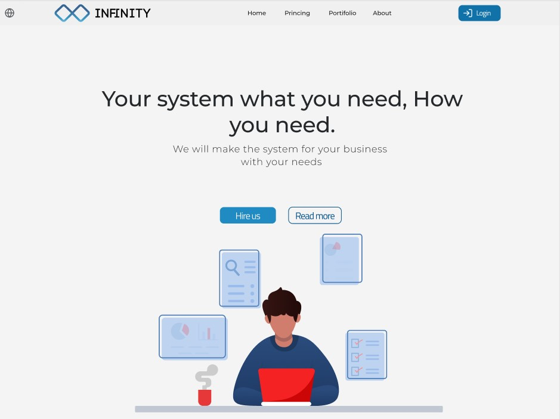

    
     
<strong>Contact us

         

 

  

## Infinity Tech Us

## 📖 About The Projeto
The website is a way to contract a system for your business, you can select between Web and Mobile.

## ⚙ Database
Inside the folder database, there is a Mysql script to correctly run this application.

## 💻 Layout
You can see the design layout on the Figma link bellow: 
 
[Figma Link](https://www.figma.com/file/EPYH5k9xyXBLKE2ocpqo3a/Infinity-Php?node-id=57%3A15)
